## SchoolFlow – Release Readiness Report (MVP)

### Resumen ejecutivo

- Front React+TS+Vite+Tailwind+shadcn y backend Firebase (Auth/Firestore/Functions).
- Build y tests: OK. Lint: 325 issues (297 errores, 28 warnings). Typecheck: OK.
- Estado funcional: mayormente “Parcial” con flujos clave demostrables (asistencia, calificaciones, boletín, alertas). Mensajería en progreso.
- Seguridad: faltan reglas Firestore versionadas. Hay guards en UI y permisos por rol.
- Veredicto: listo para demo comercial guiada de 15’ (🟡), no listo para piloto real sin reglas de seguridad (🔴).

### Health Check

| Categoría | Resultado |
|---|---|
| Lint | 325 issues (297 errores, 28 warnings) |
| Build | OK (Vite build completado) |
| Test | OK (46/46) |
| Typecheck | OK (tsc --noEmit sin errores) |

Top reglas (por incidencias):

| Regla | # |
|---|---:|
| @typescript-eslint/no-explicit-any | 278 |
| react-hooks/exhaustive-deps | 17 |
| @typescript-eslint/no-unused-vars | 12 |
| react-refresh/only-export-components | 7 |
| @typescript-eslint/ban-ts-comment | 2 |
| no-empty | 2 |
| react-hooks/rules-of-hooks | 2 |
| prefer-const | 1 |

Fuentes: `lint.json`, `lint-summary.json`. Build assets: ver salida de Vite (bundle aceptable para MVP).

### Inventario funcional

Ver `docs/MODULE_MATRIX.md` para detalle. Diagrama de flujo de datos entre módulos:

```mermaid
flowchart LR
  A["AuthContext / Firebase Auth"] --> B["Route Guards\nPrivateRoute / PermissionRoute"]
  B --> C["AppRoutes / Layout"]
  C --> D["Módulos UI"]
  subgraph Modulos
    D1["Usuarios"]
    D2["Cursos & Materias"]
    D3["Calificaciones"]
    D4["Asistencias"]
    D5["Boletines"]
    D6["Alertas"]
    D7["Reportes"]
    D8["Mensajería"]
    D9["Bot (sim)"]
    D10["Panel 360"]
  end
  D1 -->|CRUD| F["Firestore: users"]
  D2 -->|list/assign| F2["Firestore: courses, subjects, teachers, students"]
  D3 -->|grades| F3["Firestore: calificaciones, students, subjects"]
  D4 -->|attendance| F4["Firestore: attendances, students, courses"]
  D5 -->|read/compose| F5["Firestore: calificaciones, students"]
  D6 -->|alerts| F6["Firestore: alerts"]
  D7 -->|aggregations| F7["Firestore: multiple collections"]
  D8 -->|messages| F8["Firestore: messages, conversations, announcements"]
  D8 -.-> G["Cloud Functions: notifications"]
  G --> H["Firestore: notifications"]
  D9 -->|sim data| I["BotService (mock)"]
```

### Esquema de datos & seguridad

- Modelo detallado en `docs/DATA_MODEL.md`.
- Hallazgos de seguridad y checklist en `docs/SECURITY_NOTES.md`.

Riesgos principales:

- Fechas mezcladas `string`/`Timestamp`.
- Falta de `firestore.rules`/`indexes` en repo.
- Hooks condicionales en `Auditoria.tsx`.

### Calidad de código

- Detalle y quick-wins en `docs/CODE_HEALTH.md`.
- Refactorizar componentes grandes (`FloatingBot.tsx`, `DetallesCalificaciones.tsx`, `ReportesInteligentesOverview.tsx`).

### UX/UI & Accesibilidad (P0/P1/P2)

- P0: Asegurar foco/ARIA en modales (`DialogReutlizable`).
- P1: Estados vacíos consistentes y toasts; copy consistente en español.
- P2: Contraste y tab order en vistas densas (tablas, mensajería).

### Demo Readiness

- Guion y requisitos: `docs/DEMO_PLAYBOOK.md`.
- Datos seed: `scripts/seed-demo.js` (JS) o `scripts/seed-demo-data.ts` (TS). Requiere `GOOGLE_APPLICATION_CREDENTIALS`.

### Go/No-Go

- A. Demo comercial 15’: 🟡 Sí, con conductor y datos seed. Riesgos: latencia de Firestore, PDF.
- B. Piloto con 1 curso real: 🔴 No, hasta publicar reglas Firestore y cerrar P0 de hooks/fechas.
- C. Venta pagada colegio mediano: 🔴 No, requiere seguridad, monitoreo básico y refinamientos de UX.

Bloqueadores P0:

- Reglas Firestore e índices versionados y desplegados.
- Hooks condicionales corregidos (`Auditoria.tsx`).
- Tipado mínimo de `any` en módulos críticos.

Mitigaciones:

- Trabajar roadmap de 2–4 semanas (`docs/ROADMAP_CIERRE.md`).
- Preparar demo guiada con contingencias.

### Roadmap de cierre

Plan propuesto en `docs/ROADMAP_CIERRE.md` (4 sprints: seguridad, calidad, UX, mensajería/demo).

### Anexo: Migración de datos (opciones y pasos)

Viabilidad de migrar a Mongo/SQL: ver sección al final de este documento.

---

## Anexo – Migración de Datos: Opciones y pasos

Resumen: Abstraer capa de acceso a datos en `src/services/repository.ts` y hooks (`useFireStoreCollection`).

- Capa a abstraer: `repository.ts` (get/add/update/delete) + hooks de lectura.
- Equivalencias:
  - Firestore collections → Mongo collections / tablas SQL.
  - Campos comunes (createdAt/updatedAt) → controlados en backend.
- Cambios en front: mantener contrato de `DocumentOf<C>` y `CollectionName`; sustituir implementación de `repository` por fetch a API.
- Riesgos: paginación, consultas compuestas e índices. Plan por fases:
  1) Crear API de backend (Node/Express o serverless) con endpoints equivalentes.
  2) Feature flag para alternar proveedor de datos.
  3) Migración incremental por módulo (usuarios, cursos, etc.).

